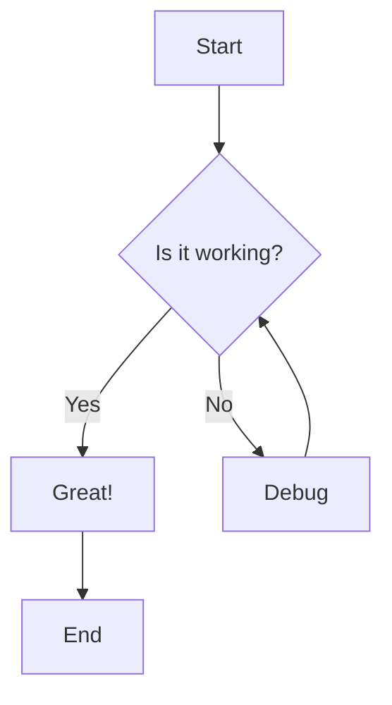
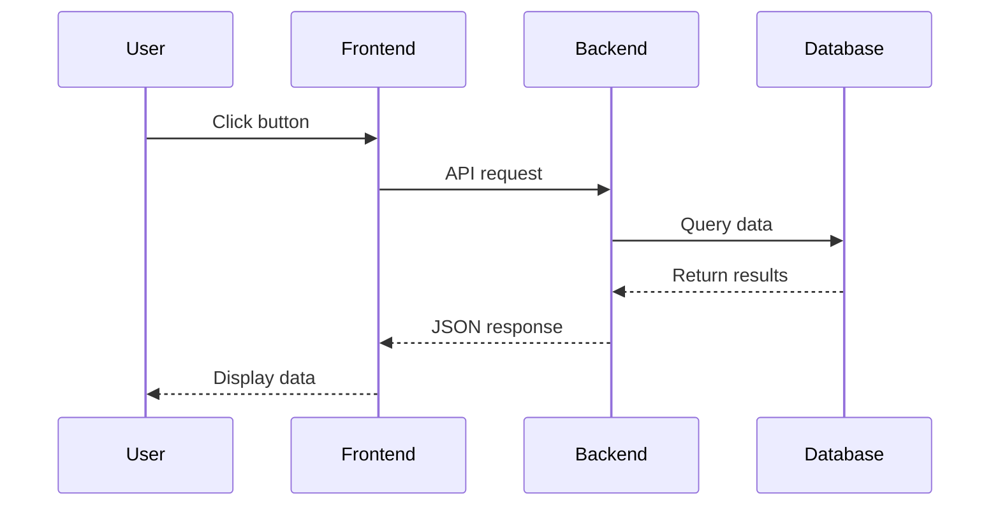
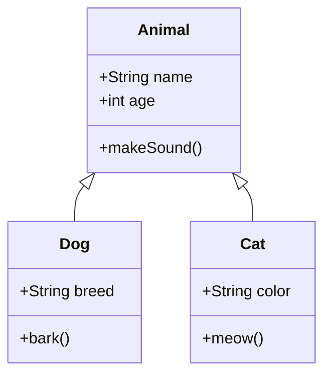
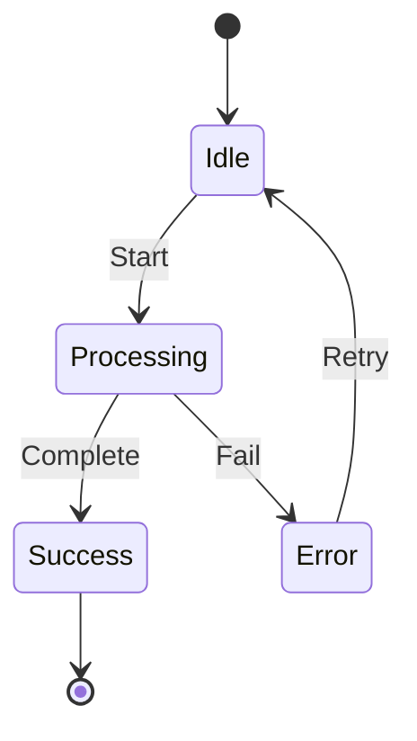
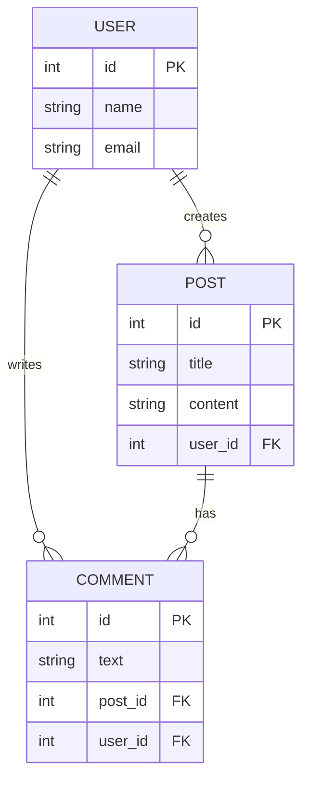
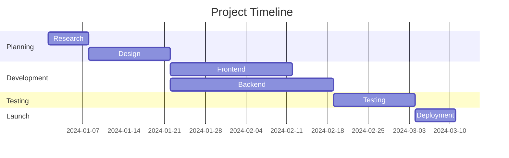
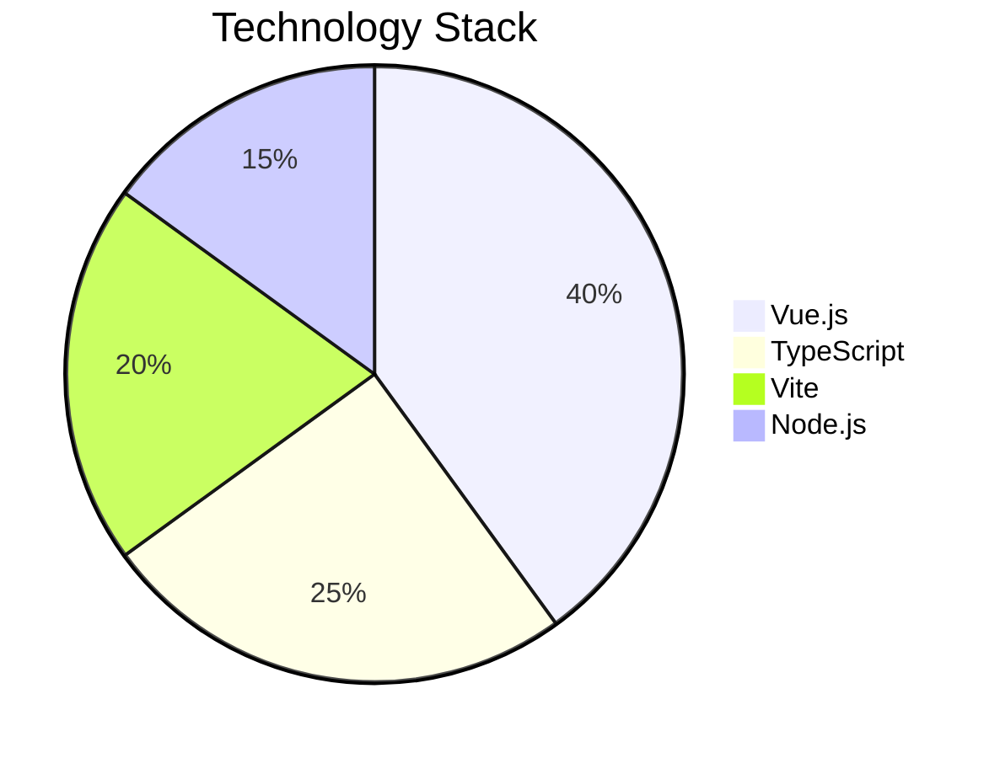
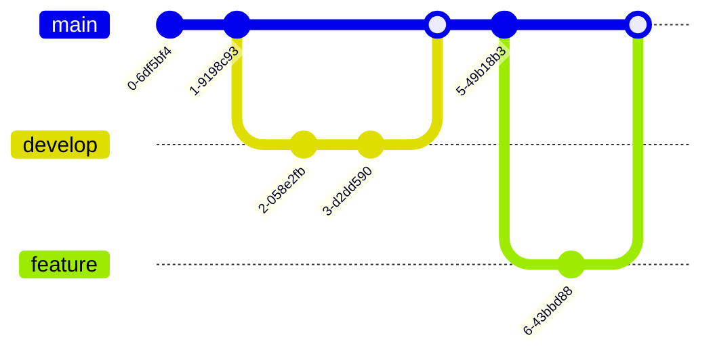

# Diagrams

Create diagrams using Mermaid syntax.

## Flowchart

## Sequence Diagram

## Class Diagram

## State Diagram

## Entity Relationship Diagram

## Gantt Chart

## Pie Chart

## Git Graph

