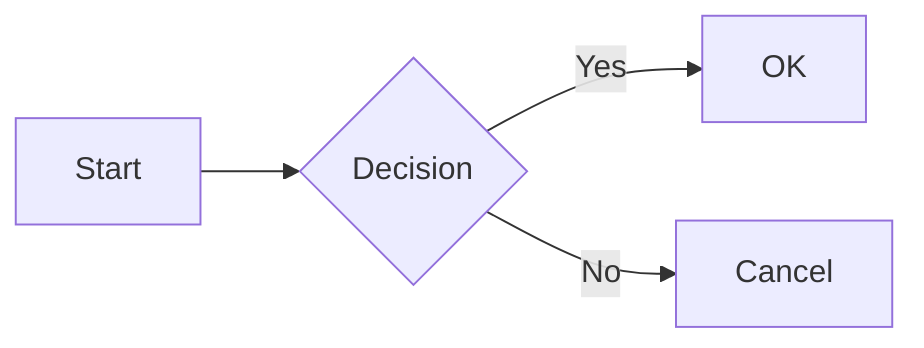

# Markdown Extensions

LDoc extends standard Markdown with powerful features for technical documentation.

## Code Blocks

### Syntax Highlighting

````md
```js
const greeting = 'Hello, LDoc!'
console.log(greeting)
```
````

### Line Numbers

````md
```js:line-numbers
const a = 1
const b = 2
const c = a + b
```
````

### Line Highlighting

````md
```js{1,3-4}
const a = 1  // highlighted
const b = 2
const c = 3  // highlighted
const d = 4  // highlighted
```
````

### Code Groups

````md
::: code-group
```npm
npm install @ldesign/doc
```
```pnpm
pnpm add @ldesign/doc
```
```yarn
yarn add @ldesign/doc
```
:::
````

## Custom Containers

### Info

```md
::: info
This is an info box.
:::
```

::: info
This is an info box.
:::

### Tip

```md
::: tip
This is a tip.
:::
```

::: tip
This is a tip.
:::

### Warning

```md
::: warning
This is a warning.
:::
```

::: warning
This is a warning.
:::

### Danger

```md
::: danger
This is a danger alert.
:::
```

::: danger
This is a danger alert.
:::

### Details

```md
::: details Click to expand
Hidden content here.
:::
```

::: details Click to expand
Hidden content here.
:::

## Tables

```md
| Feature | Status |
|---------|--------|
| Markdown | ✅ |
| Vue Components | ✅ |
| Search | ✅ |
```

| Feature | Status |
|---------|--------|
| Markdown | ✅ |
| Vue Components | ✅ |
| Search | ✅ |

## Emoji

```md
:smile: :heart: :thumbsup:
```

:smile: :heart: :thumbsup:

## Math Equations

Inline math: `$E = mc^2$`

Block math:

```md
$$
\frac{n!}{k!(n-k)!} = \binom{n}{k}
$$
```

## Mermaid Diagrams

````md

````
