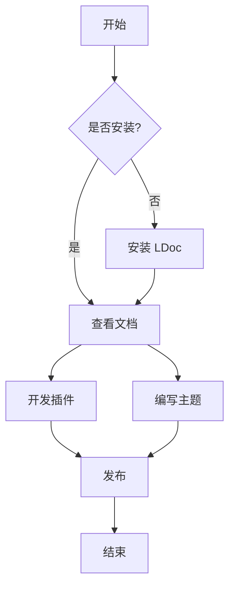
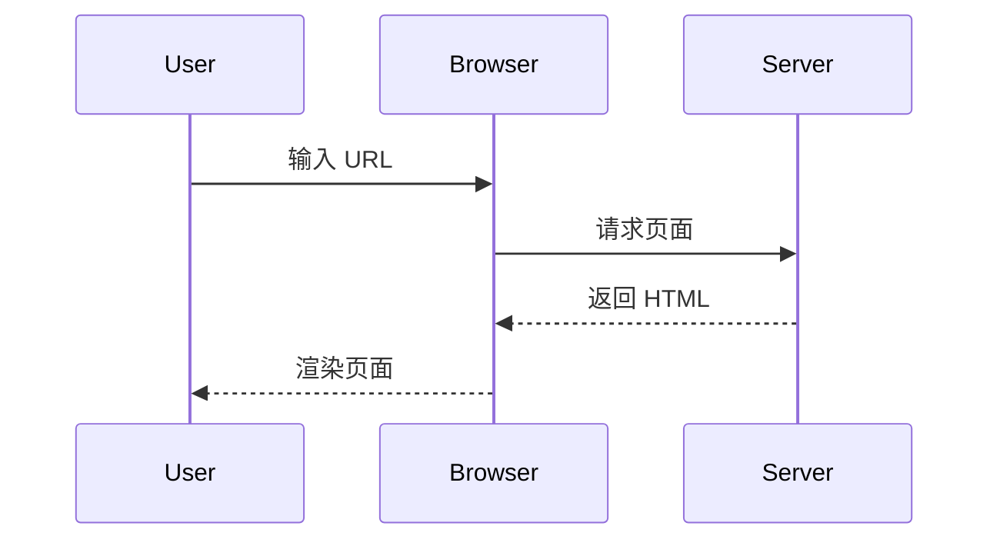

# 容器与扩展语法

LDoc 支持丰富的 Markdown 扩展语法，让您的文档更加生动。

## 提示容器

::: tip 提示
这是一个提示容器，用于展示一般性信息。
:::

::: warning 警告
这是一个警告容器，用于展示需要注意的内容。
:::

::: danger 危险
这是一个危险容器，用于展示潜在的风险操作。
:::

::: info 信息
这是一个信息容器，补充说明。
:::

::: details 点击查看详情
这里是隐藏的详细内容，点击标题即可展开。
可以包含代码块：
```ts
console.log('Hello World')
```
:::

## 标签页 Tabs

::: tabs
@tab npm
```bash
npm install @ldesign/doc
```

@tab pnpm
```bash
pnpm add @ldesign/doc
```

@tab yarn
```bash
yarn add @ldesign/doc
```
:::

## 代码组

::: code-group
```ts [config.ts]
// 配置文件
export default {
  title: 'My Site'
}
```

```vue [App.vue]
<template>
  <h1>Hello</h1>
</template>
```
:::

## 步骤条 Steps

::: steps
1. **安装依赖**
   使用包管理器安装 LDoc。

2. **创建配置文件**
   在项目根目录下创建 `.ldesign/doc.config.ts`。

3. **编写文档**
   开始编写 Markdown 文档。

4. **启动服务**
   运行 `ldoc dev` 启动预览。
:::

## 文件树 File Tree

::: file-tree
- .ldesign/
  - doc.config.ts
- src/
  - index.md
  - guide/
    - getting-started.md
- package.json
:::

## 卡片网格

::: card-grid 3
::: card 快速开始
了解如何快速搭建文档网站。
:::

::: card 配置指南
详细的配置选项说明。
:::

::: card 插件开发
如何编写自定义插件。
:::
:::

## 徽章

在行内使用徽章：
- 这是一个徽章 ::: badge tip 推荐 :::
- 这是一个警告 ::: badge warning 注意 :::
- 这是一个错误 ::: badge danger 错误 :::
- 这是一个信息 ::: badge info 提示 :::

## 数学公式 (KaTeX)

行内公式：$E=mc^2$

块级公式：

$$
\frac{1}{\Bigl(\sqrt{\phi \sqrt{5}}-\phi\Bigr) e^{\frac25 \pi}} = 1+\frac{e^{-2\pi}} {1+\frac{e^{-4\pi}} {1+\frac{e^{-6\pi}} {1+\frac{e^{-8\pi}} {1+\cdots} } } }
$$

## 流程图 (Mermaid)




