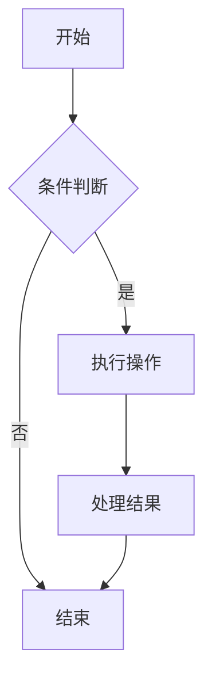
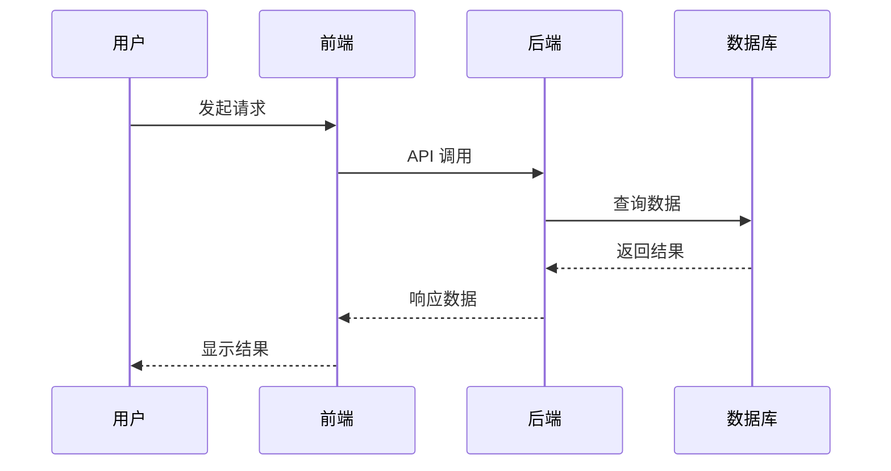
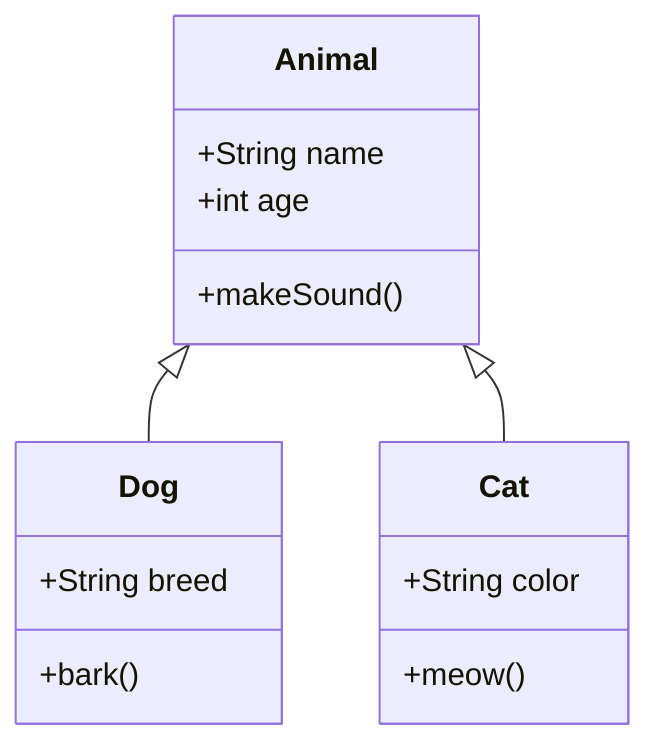

# 功能展示

本页面展示了 LDoc 文档系统支持的所有功能，包括 Markdown 增强渲染、图表支持、代码高亮、图片处理等。

## 目录

- [代码块](#代码块)
- [图表支持](#图表支持)
- [图片处理](#图片处理)
- [数学公式](#数学公式)
- [容器组件](#容器组件)
- [高级功能](#高级功能)

## 代码块

### 基础代码高亮

```javascript
// JavaScript 示例
function greet(name) {
  return `Hello, ${name}!`;
}

const message = greet('LDoc');
console.log(message);
```

### 行高亮

```js{2,4-6}
function calculateSum(numbers) {
  let sum = 0;
  for (const num of numbers) {
    sum += num; // 高亮这一行
  }
  return sum;
}

const result = calculateSum([1, 2, 3, 4, 5]);
console.log(result); // 15
```

### 行号显示

```python
# Python 示例（带行号）
def fibonacci(n):
    if n <= 1:
        return n
    return fibonacci(n-1) + fibonacci(n-2)

# 计算前 10 个斐波那契数
for i in range(10):
    print(fibonacci(i))
```

### 代码组

::: code-group

```js [JavaScript]
const users = ['Alice', 'Bob', 'Charlie'];
users.forEach(user => console.log(user));
```

```python [Python]
users = ['Alice', 'Bob', 'Charlie']
for user in users:
    print(user)
```

```bash [Bash]
echo "Alice"
echo "Bob" 
echo "Charlie"
```

:::

## 图表支持

### Mermaid 图表

#### 流程图



#### 时序图



#### 类图



### ECharts 图表

#### 柱状图

```echarts
{
  "title": {
    "text": "月度销售数据"
  },
  "tooltip": {},
  "legend": {
    "data": ["销量"]
  },
  "xAxis": {
    "data": ["一月", "二月", "三月", "四月", "五月", "六月"]
  },
  "yAxis": {},
  "series": [{
    "name": "销量",
    "type": "bar",
    "data": [5, 20, 36, 10, 10, 20]
  }]
}
```

#### 折线图

```echarts
{
  "title": {
    "text": "用户增长趋势"
  },
  "tooltip": {
    "trigger": "axis"
  },
  "legend": {
    "data": ["新用户", "活跃用户"]
  },
  "xAxis": {
    "type": "category",
    "data": ["周一", "周二", "周三", "周四", "周五", "周六", "周日"]
  },
  "yAxis": {
    "type": "value"
  },
  "series": [
    {
      "name": "新用户",
      "type": "line",
      "data": [120, 132, 101, 134, 90, 230, 210]
    },
    {
      "name": "活跃用户", 
      "type": "line",
      "data": [220, 182, 191, 234, 290, 330, 310]
    }
  ]
}
```

#### 饼图

```echarts
{
  "title": {
    "text": "设备使用统计",
    "left": "center"
  },
  "tooltip": {
    "trigger": "item"
  },
  "legend": {
    "orient": "vertical",
    "left": "left"
  },
  "series": [
    {
      "name": "访问来源",
      "type": "pie",
      "radius": "50%",
      "data": [
        {"value": 1048, "name": "桌面端"},
        {"value": 735, "name": "移动端"},
        {"value": 580, "name": "平板"},
        {"value": 484, "name": "其他"}
      ]
    }
  ]
}
```

## 图片处理

### 基础图片


### 带标题的图片


*这是一个示例图片的标题说明*

### 图片对齐和尺寸

<div style="text-align: center;">

</div>

{width=150}

### 远程图片


## 数学公式

### 行内公式

爱因斯坦的质能方程：$E = mc^2$

### 块级公式

$$
\int_{-\infty}^{\infty} e^{-x^2} dx = \sqrt{\pi}
$$

### 复杂公式

$$
\begin{aligned}
\nabla \times \vec{\mathbf{B}} - \frac{1}{c}\frac{\partial \vec{\mathbf{E}}}{\partial t} &= \frac{4\pi}{c}\vec{\mathbf{j}} \\
\nabla \cdot \vec{\mathbf{E}} &= 4 \pi \rho \\
\nabla \times \vec{\mathbf{E}} + \frac{1}{c}\frac{\partial \vec{\mathbf{B}}}{\partial t} &= \vec{\mathbf{0}} \\
\nabla \cdot \vec{\mathbf{B}} &= 0
\end{aligned}
$$

## 容器组件

### 信息提示

::: tip 提示
这是一个提示信息容器，用于显示有用的提示和建议。
:::

::: warning 警告
这是一个警告信息容器，用于提醒用户注意重要事项。
:::

::: danger 危险
这是一个危险信息容器，用于显示警告和错误信息。
:::

::: info 信息
这是一个信息容器，用于显示一般性的信息。
:::

### 代码容器

::: details 点击查看代码示例
```javascript
function example() {
  console.log("这是一个可折叠的代码块");
}
```
:::

### 自定义容器

::: note 📝 笔记
这是一个自定义的笔记容器，支持自定义标题和图标。
:::

::: important 🔑 重要
这是一个重要信息容器，用于强调关键内容。
:::

## 高级功能

### 表格

| 功能 | 支持状态 | 说明 |
|------|----------|------|
| 代码高亮 | ✅ | 支持多种编程语言的语法高亮 |
| 图表渲染 | ✅ | 支持 Mermaid 和 ECharts |
| 数学公式 | ✅ | 支持 LaTeX 数学公式 |
| 图片处理 | ✅ | 自动添加懒加载和异步解码 |
| 导出功能 | ✅ | 支持 PDF 和 HTML 导出 |
| 搜索功能 | ✅ | 全文搜索和高亮显示 |

### 任务列表

- [x] 完成 Markdown 增强渲染
- [x] 添加 Mermaid 图表支持
- [x] 集成 ECharts 图表
- [x] 实现图片懒加载
- [x] 添加数学公式支持
- [x] 优化搜索功能
- [x] 完善 PDF 导出
- [ ] 添加更多主题选项
- [ ] 支持多语言切换
- [ ] 集成评论系统

### 脚注

这是一个包含脚注的示例[^1]。脚注可以用来添加补充信息或引用。

[^1]: 这是第一个脚注的内容。

### 引用

> "好的文档是优秀软件的重要组成部分。"
> 
> — 某位智者

### 缩写

HTML 是一种标记语言，CSS 用于样式设计，JavaScript 负责交互逻辑。

### 标记

你可以使用 ==高亮文本== 来强调重要内容，也可以使用 ~~删除线~~ 表示移除的内容。

### 键盘按键

按 <kbd>Ctrl</kbd> + <kbd>S</kbd> 保存文件，按 <kbd>Alt</kbd> + <kbd>Tab</kbd> 切换窗口。

## 导出功能

本页面支持以下导出格式：

- **PDF 导出**：保留所有样式、图表和格式，适合打印和分享
- **HTML 导出**：生成单页 HTML 文件，包含所有资源

点击页面底部的导出按钮即可体验导出功能。导出的文件将包含：

- 完整的页面内容和样式
- 渲染后的图表（Mermaid 和 ECharts）
- 数学公式和代码高亮
- 优化的打印样式

---

**提示**：这个展示页面涵盖了 LDoc 的主要功能特性。你可以在自己的文档中使用这些功能来创建丰富、专业的文档内容。
