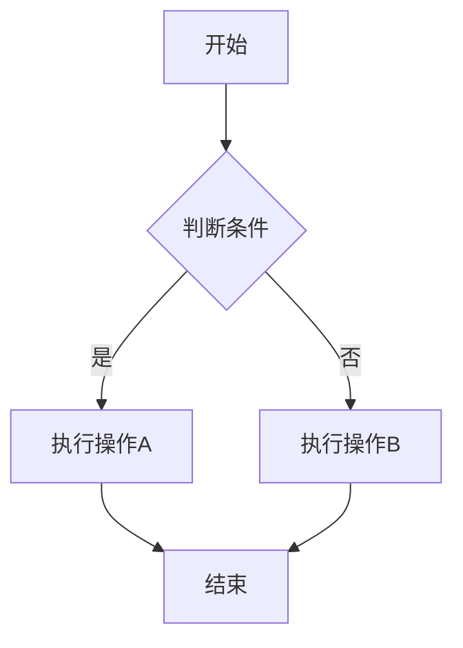
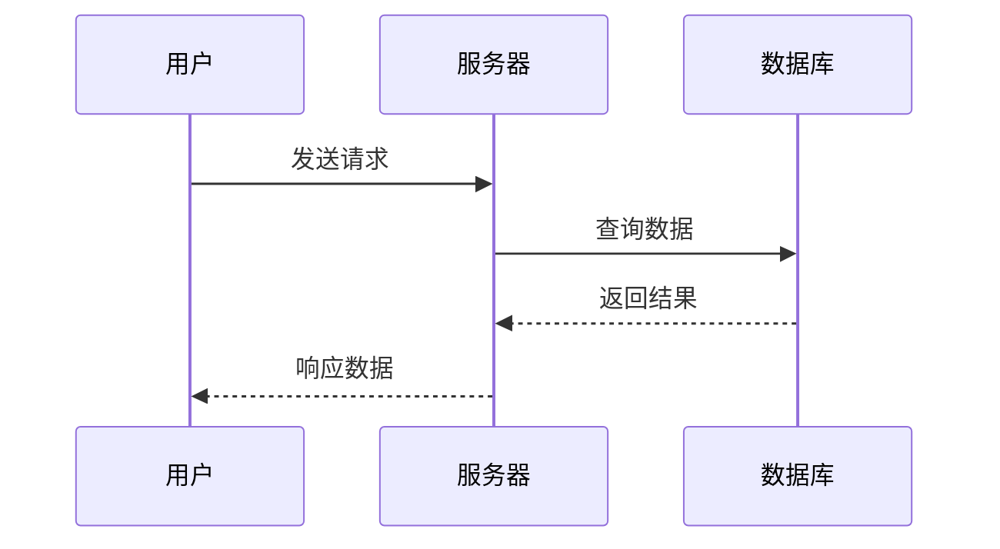
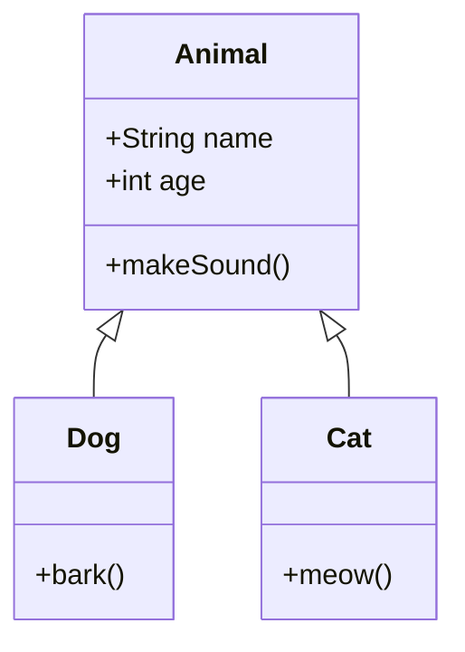
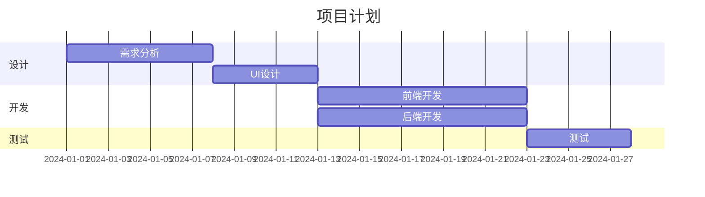

# 流程图与图表

LDoc 支持使用 Mermaid 语法创建各种图表。

::: tip 启用 Mermaid
在配置中启用 Mermaid 支持后即可使用。
:::

## 流程图

```mermaid
graph TD
    A[开始] --> B{判断条件}
    B -->|是| C[执行操作A]
    B -->|否| D[执行操作B]
    C --> E[结束]
    D --> E
```

## 时序图

```mermaid
sequenceDiagram
    participant 用户
    participant 服务器
    participant 数据库
    用户->>服务器: 发送请求
    服务器->>数据库: 查询数据
    数据库-->>服务器: 返回结果
    服务器-->>用户: 响应数据
```

## 类图

```mermaid
classDiagram
    class Animal {
        +String name
        +int age
        +makeSound()
    }
    class Dog {
        +bark()
    }
    class Cat {
        +meow()
    }
    Animal <|-- Dog
    Animal <|-- Cat
```

## 甘特图

```mermaid
gantt
    title 项目计划
    dateFormat  YYYY-MM-DD
    section 设计
    需求分析    :a1, 2024-01-01, 7d
    UI设计      :a2, after a1, 5d
    section 开发
    前端开发    :b1, after a2, 10d
    后端开发    :b2, after a2, 10d
    section 测试
    测试        :c1, after b1, 5d
```
